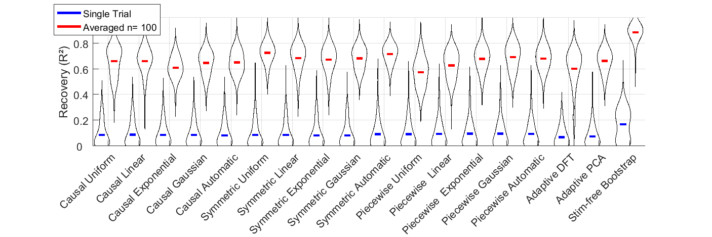

Repo contains source code for creating and filtering EEG data from _periodic, non-sinusoidal_ and _non-stationary_ tCS artifacts using ___weighted comb filters___.

Includes also code for artifact removal using ___adaptive DFT___ and ___adaptive PCA___, and for simulation of tACS recordings.

This research is supported by the [BMBF: FKZ 13GW0119](https://www.medizintechnologie.de/fileadmin/pdfs/Projektsteckbriefe_bekanntmachungen/IndiMedtech/13GW0119_Projektsteckbrief_NEU.pdf).

#### Use Case
| _Upper Limb Bipolar ECG recording_ <br> _during 11 Hz tACS_ ||
|:----:|:----:|
| _Recover the ECG_<br>(which is ~120dB weaker than tACS) ||
#### Performance
||
|:----:|
||
|_Recovery (as R² between filtered and stim-free ECG) for various filtering approaches_|

#### Weighted Comb Filter
Filters the signal. Artifact can be _non-stationary_ and  _non-sinusoidal_, but is required to be _periodic_. Comb filters natively support only frequencies which are integer divisibles of the sampling frequency. When artacs.kernel.run is used, the signal is automatically resampled, to circumvent this limitation. Note that the method still requires integer frequencies.

By default, the kernel is symmetric and weights are based empirically on the artifacts periodic autocorrelation.

```matlab
% Add package to path
addpath('.\src\')

% Run a kernel filter, with automatic weights as default
% based on 10 neighbouring periods
% filter a frequency of 11 Hz
% for a signal recorded at 1000 Hz
NumberPeriods   = 10;
Freq            = 11;
Fs              = 1000;
filtered_signal = artacs.kernel.run(Signal,Freq,NumberPeriods,Fs)

% You can also create own kernels
% e.g a symmetric uniform kernel
wfun            = 'uniform'; % wfun can be 'uniform', 'linear', 'exp', 'gauss', 'automatic'
symflag         = 'symmetric'; % symflag  can be 'causal', 'symmetric', 'right', or 'piecewise'.
filtered_signal = artacs.kernel.run(Signal,Freq,NumberPeriods,Fs,symflag,wfun)
```
Piecewise filtering splits the signal in half (or at a specified latency), filters the left half forward and the right half backwards, and fuses the signal again. Comb filters can cause echos (see causal uniform filter). Piecewise filtering can help to reduce the echo of an ERP in the filtered signal if the ERP latency is known (within roughly half the artifacts period).
```matlab
filtered_signal = artacs.kernel.run(Signal,Freq,NumberPeriods,Fs,'piecewise','gauss')
```


#### Template Based (Adaptive PCA)
Artifact can be _non-stationary_ and  _non-sinusoidal_, but is required to be _periodic_. Estimates the time-course of artifact amplitude modulation across periods, and removes its prinical components  until artifact power is suppressed below the level of neighbouring frequencies. Works only for integer frequencies.
```matlab
% based on adaptive stepwise removal of prinicipal components
% of the artifact amplitude modulation.
filtered_signal = artacs.template.stepwise(Signal,Freq,Fs)
```

#### Sinusoidal Filter (Adaptive DFT)
Artifact is assummed to be _sinusoidal_, and _periodic_, but can be _non-stationary_. The sinusoidal artifacts amplitude is estimated either _local_ (i.e. for the past _NumberPeriods_ periods) or for the _complete_ signal duration and removed. Works natively for any real frequency.
```matlab
% based on adaptive local dft
filtered_signal = artacs.dft.local(Signal,Freq,Fs,NumberPeriods)

% filter harmonics by using a vector for Freq
filtered_signal = artacs.dft.local(Signal,[1:4]*Freq,Fs,NumberPeriods)

% use fft/ifft on the complete trial duration
filtered_signal = artacs.dft.complete(Signal,Freq,Fs)
```

###### More information:
[On creating simulated signals](generate.md)

[On inspecting  kernels in time and frequency domain](response.md)

###### Task List

- [ ] Allow filtering for non-integer frequencies
- [ ] Translate the code to Python3
- [ ] Proper Unit Tests
- [ ] Extend Documentation
- [ ] Write up results of evaluation on real data
---
